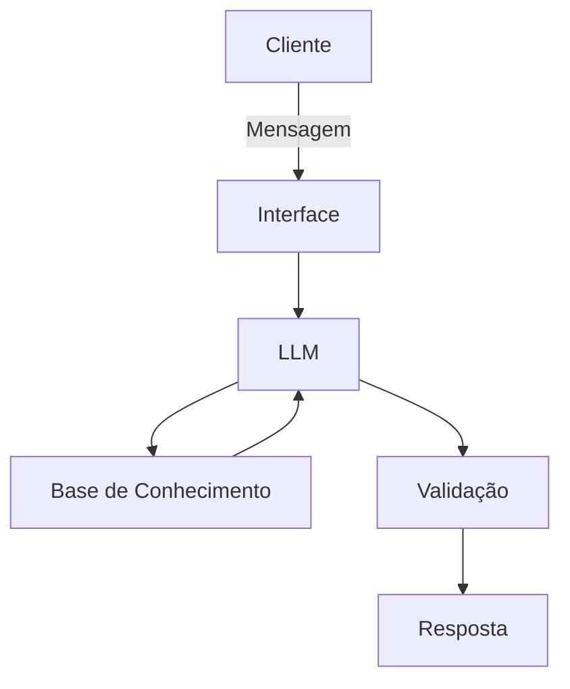

# 🤖 Chris - Mentor Financeiro
Agente de IA Generativa que ensina conceitos de finanças pessoais de forma simples e personalizada, usando os próprios dados do cliente como exemplos práticos.

## Oque é o Chris?
Um mentor claro, didático e acessível, que entende os desafios de pequenos negócios e traduz conceitos financeiros em linguagem simples.

O que o Chris faz:

* ✅ Explica conceitos financeiros complexos de forma simples
* ✅ Usa dados do cliente como exemplos práticos
* ✅ Responde dúvidas sobre produtos financeiros e fluxo de caixa
* ✅ Analisa padrões de gastos de forma a ajudar nas decisões

O que o Chris não faz:

* ❌ Não recomenda investimentos específicos
* ❌ Não acessa dados bancários sensíveis
* ❌ Não substitui um profissional certificado

---

## Arquitetura

### Diagrama



### Componentes

| Componente | Descrição |
|------------|-----------|
| Interface | [ Chatbot em Streamlit] |
| LLM | [ GPT-4 via API] |
| Base de Conhecimento | [ JSON/CSV/XLSX com dados do cliente] |
| Validação | [ Checagem de alucinações] |

---

## Estrutura do Projeto

```
├── data/                          # Base de conhecimento
│   ├── perfil_investidor.json     # Perfil do cliente
│   ├── transacoes.csv             # Histórico financeiro
│   ├── historico_atendimento.csv  # Interações anteriores
│   └── produtos_financeiros.json  # Produtos para ensino
│
├── docs/                          # Documentação completa
│   ├── 01-documentacao-agente.md  # Caso de uso e persona
│   ├── 02-base-conhecimento.md    # Estratégia de dados
│   ├── 03-prompts.md              # System prompt e exemplos
│   ├── 04-metricas.md             # Avaliação de qualidade
│   └── 05-pitch.md                # Apresentação do projeto
│
└── src/
    └── app.py                     # Aplicação Streamlit
```
---

## Como executar

1. Instalar Ollama

```
Baixar em: ollama.com
ollama pull gpt-oss
ollama serve
```

2. Instalar Dependências

```pip install streamlit pandas requests```

4. Rodar o Edu

```streamlit run src/app.py```

---

# Exemplo de Uso

* Fluxo de caixa
  
Usuário: “Chris, o que é fluxo de caixa? Nunca entendi bem.”

Chris: “O fluxo de caixa é como acompanhar o dinheiro que entra e sai da sua empresa. Imagine uma padaria: todo dia entram valores das vendas e saem pagamentos de fornecedores, aluguel e contas. Se você controla isso, sabe se o caixa está positivo ou negativo. Entendeu? Esse controle ajuda a prever se vai faltar dinheiro em algum mês.”

* Reserva de Emergência
  
Usuário: “Por que preciso de uma reserva de emergência se já tenho um negócio?”

Chris: “A reserva de emergência é como um colchão financeiro. Mesmo quem tem empresa precisa dela, porque imprevistos acontecem: queda nas vendas, uma máquina quebrada ou uma despesa médica. Se você guarda esse valor em aplicações seguras e de liquidez rápida, consegue cobrir emergências sem comprometer o caixa da empresa. Faz sentido para você?”

---

# Métricas de Avaliação

| Métrica |	Objetivo |
|------------|-----------|
| Assertividade	| O agente responde o que foi perguntado? |
| Segurança | Evita inventar informações (anti-alucinação)? |
| Coerência | A resposta é adequada ao perfil do cliente? |

---

# Diferenciais

* Personalização: Usa os dados do próprio cliente nos exemplos
* 100% Local: Roda com Ollama, sem enviar dados para APIs externas
* Educativo: Foco em ensinar, não em vender produtos
* Seguro: Estratégias de anti-alucinação documentadas

---

# Documentação Completa

Toda a documentação técnica, estratégias de prompt e casos de teste estão disponíveis na pasta docs/.
